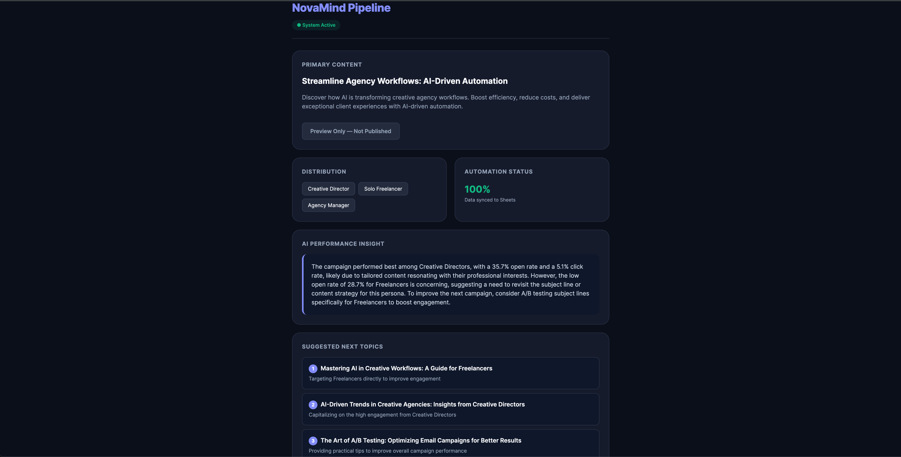

# NovaMind AI Content Pipeline

An automated marketing pipeline that generates, distributes, and analyzes blog and newsletter content using AI — built with n8n, Mistral AI, and Google Sheets.

---

## Overview

NovaMind is a fictional early-stage AI startup helping creative agencies automate their workflows. This pipeline takes a blog topic as input and fully automates content creation, audience segmentation, campaign logging, performance analysis, and next-topic recommendations — with zero manual steps after triggering.

---

## Architecture

```
[Webhook Trigger]
       ↓
[Edit Fields]              — normalize input, generate campaign_id + timestamp
       ↓
[Basic LLM Chain]          — Mistral AI generates blog + 3 persona newsletters (JSON)
       ↓
[Code: Parse JSON]         — extract and structure AI output
       ↓
[Google Sheets #1]         — log content to "Content" sheet
       ↓
[Code: Simulate Metrics]   — generate mock open/click/unsubscribe rates per persona
       ↓
[Google Sheets #2]         — log analytics to "Analytics" sheet
       ↓
[Wait Nodes]               — 3-5s buffer to prevent Mistral rate limit errors
       ↓
[Performance Summary]      — Mistral AI writes plain-text campaign insight
       ↓
[Aggregate]                — combine 3 persona metrics into single item
       ↓
[Topic Suggestions]        — Mistral AI suggests 3 next blog topics based on metrics
       ↓
[Parse Suggestions]        — extract topic suggestions from AI output
       ↓
[Respond to Webhook]       — return HTML dashboard with all results
```

---

## Tools & Technologies

| Component | Tool |
|---|---|
| Workflow automation | [n8n](https://n8n.io) (self-hosted, local) |
| AI model | Mistral AI — `mistral-small-latest` via LangChain Basic LLM Chain |
| Content storage | Google Sheets (2 tabs: Content, Analytics) |
| Trigger interface | HTTP Webhook (GET/POST) |
| Dashboard | HTML response from Respond to Webhook node |

---

## Features

- **AI Content Generation** — Single LLM call produces a full blog draft (800–1000 words with SEO metadata) + 3 persona-targeted newsletter versions in one structured JSON response.
- **Persona Segmentation** — Content is automatically personalized for 3 audience types: *Creative Director*, *Freelancer*, and *Agency Manager*.
- **CRM Simulation** — Google Sheets serves as a lightweight mock CRM, logging all campaign content and analytics history in a structured format that mirrors HubSpot's Contacts and Timeline API payload structure.
- **AI Performance Summary** — Mistral analyzes simulated metrics and generates a 3–4 sentence plain-text insight identifying the top-performing persona and recommending improvements.
- **Bonus: AI Topic Suggestions** — After each campaign, the pipeline automatically suggests 3 next blog topics based on engagement trends from that run.
- **Bonus: Live Dashboard UI** — Respond to Webhook returns a styled HTML dashboard showing blog output, distribution status, AI insight, and topic suggestions.

---

## Assumptions & Design Decisions

- **Google Sheets as CRM**: HubSpot free tier requires a verified domain for email sending. Google Sheets was used as a zero-cost substitute that demonstrates the same data structure — contact logging, campaign tracking, and persona segmentation. The payload structure mirrors what would be sent to HubSpot's Contacts and Timeline APIs in a production environment.
- **Simulated metrics**: Newsletter performance data (open rate, click rate, unsubscribe rate) is randomly generated within realistic ranges. In production, these would be fetched from HubSpot, Mailchimp, or a similar platform via API.
- **Mistral AI**: Used instead of OpenAI due to free tier availability. The `mistral-small-latest` model reliably produces structured JSON output when prompted correctly.
- **Wait nodes**: Added between consecutive LLM calls to prevent 503 rate limit errors on Mistral's free tier. Each wait is 3–5 seconds.
- **"Preview Only" button**: The generated blog URL (`www.novamind.com/blog/...`) is a mock slug. The button is intentionally disabled to reflect that no live site exists.

---

## Project Structure

```
novamind-ai-pipeline/
├── nova-workflow.json         ← Import this into n8n
├── ui/
│   └── trigger.html           ← HTML dashboard UI
└── README.md
```

---

## How to Run Locally

### Prerequisites

- Node.js v20+ ([nodejs.org](https://nodejs.org))
- n8n installed globally: `npm install -g n8n`
- Mistral AI API key ([console.mistral.ai](https://console.mistral.ai) — free tier)
- Google account with Google Sheets access

### Step 1 — Set up Google Sheets

Create a new Google Spreadsheet with 2 tabs named exactly as follows:

**Tab 1 — "Content"**
```
Title | Meta Description | URL | Draft | Newsletter Creative Director | Newsletter Freelancer | Newsletter Agency Manager | Timestamp
```

**Tab 2 — "Analytics"**
```
Campaign_ID | Persona | Open_Rate | Click_Rate | Unsubscribe_Rate | Emails_Sent | Timestamp
```

### Step 2 — Import and configure n8n

1. Start n8n: `n8n start` then open [http://localhost:5678](http://localhost:5678)
2. Top-right menu (⋮) → **Import from file** → select `nova-workflow.json`
3. Go to **Settings → Credentials** and add:
   - **Mistral Cloud** — paste your API key
   - **Google Sheets OAuth2** — connect your Google account
4. Open the two Google Sheets nodes and point them to your spreadsheet

### Step 3 — Trigger the pipeline

Open this URL in your browser (replace the topic as needed):

```
http://localhost:5678/webhook-test/novamind-pipeline?topic=AI+Automation+for+Agencies&author=Your+Name
```

The browser will display the live HTML dashboard after ~30–60 seconds.

### Step 4 — View results

- **Dashboard**: returned directly in the browser
- **Content tab**: blog title, meta description, full draft, 3 newsletters
- **Analytics tab**: open/click/unsubscribe metrics per persona, stored historically

---

## Dashboard Screenshot


</p>
